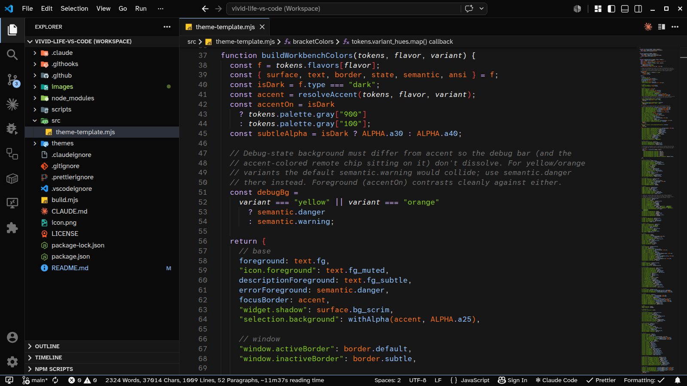
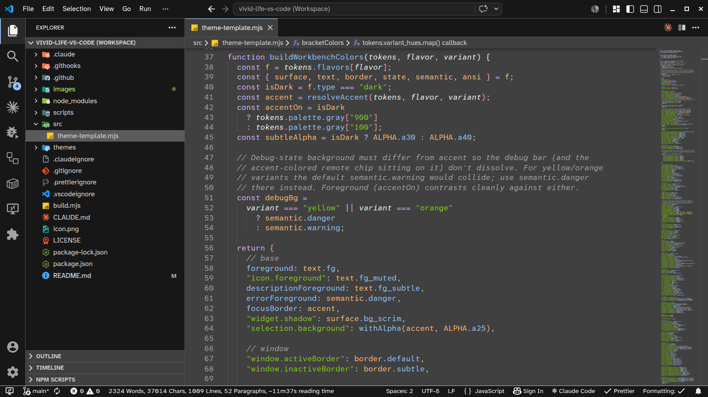
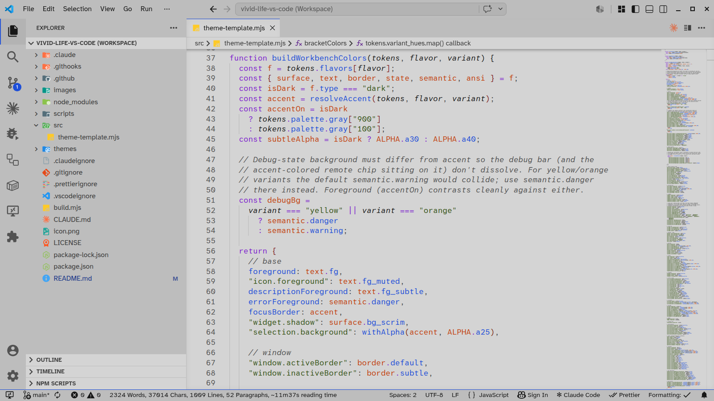
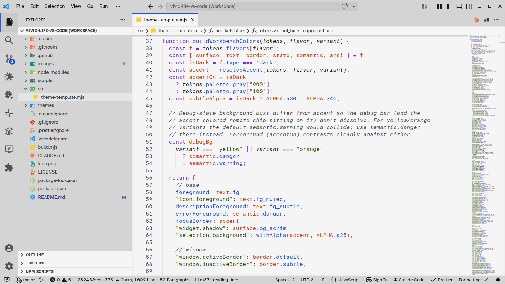

# Vivid Life Theme — VS Code

A multi-flavor color theme for VS Code (Visual Studio Code). **4 flavors × 6 variants = 24 themes**,
all WCAG AA verified. Generated from the
[Vivid Life design-system foundation](https://github.com/vivid-life-theme/vivid-life-design-system)
— colors, contrast ratios, and the syntax-token map all come from a single
source of truth.






## Flavors

In time-of-day order:

| Flavor       | Type  | Canvas    |
| ------------ | ----- | --------- |
| **Midnight** | dark  | `#171717` |
| **Twilight** | dark  | `#404040` |
| **Dawn**     | light | `#d4d4d4` |
| **Noon**     | light | `#f5f5f5` |

## Variants

Each flavor is available in six accent variants: **Red · Orange · Yellow ·
Green · Blue · Purple**. The variant only re-tints the accent (cursor, focus
ring, status bar, badges); the syntax-token map stays stable across variants
so a file's "shape" reads the same whether you're in Midnight · Blue or
Noon · Yellow.

## Install

From the VS Code Marketplace: search for **Vivid Life Theme**, install, then
pick one of the 24 entries from `Preferences: Color Theme` (`Ctrl+K Ctrl+T`).

## Recommended companions

- **File icons** — [Material Icon Theme](https://marketplace.visualstudio.com/items?itemName=PKief.material-icon-theme).
  Vivid Life does not ship its own file icons; the design system recommends
  Material because it covers ~ all the file types VS Code recognizes.
- **Font** — [Atkinson Hyperlegible Mono](https://www.brailleinstitute.org/freefont)
  for the editor. The fallback stack still respects whatever monospaced
  font you have installed locally (Cascadia Code, JetBrains Mono, …).

## Contributing

```bash
npm install
npm run build           # regenerates themes/ from @vivid-life-theme/design-system
```

To preview locally: press `F5` in VS Code (Extension Development Host) and
switch themes inside the dev window.

If you spot a color, contrast, or syntax-slot mismatch that isn't a mapping
bug in this port, please open an issue against the
[design system repo](https://github.com/vivid-life-theme/vivid-life-design-system/issues)
rather than here — port-side workarounds get unmaintainable fast.

## License

MIT. See [LICENSE](./LICENSE).
